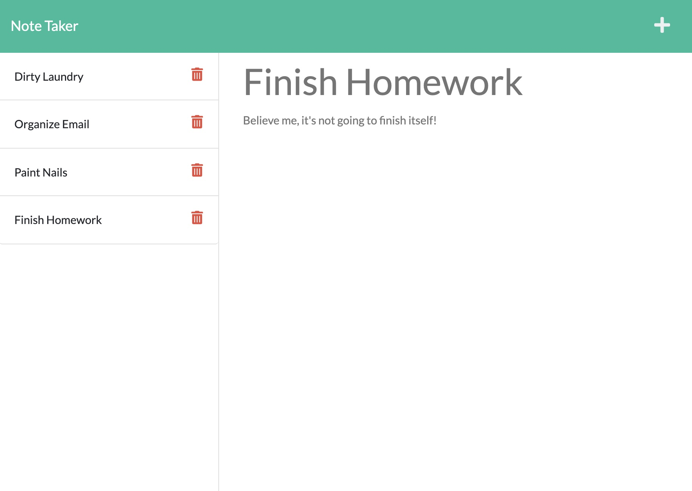
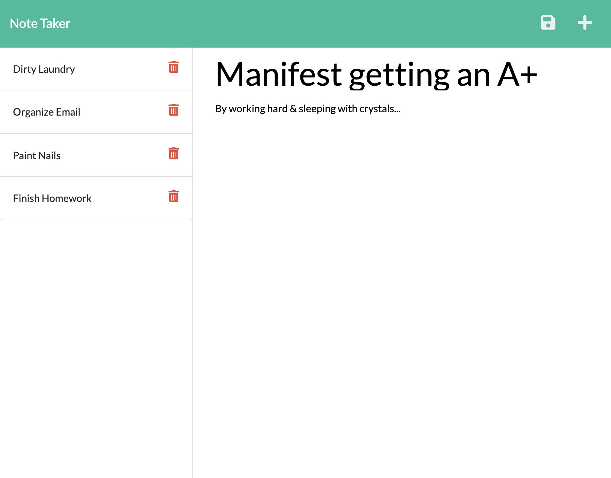

# Note Taker App with Express.js

## Description
A full-stack application that allows for a user to write and save notes. This application will aid in organizing your thoughts and keeping track of tasks you need to complete.

## Table of Contents

- [Usage](#usage)
- [Visuals](#visuals) 
- [Links](#links)

## Usage
Visit the application to get started! Type in your notes and add detailed descriptions. Save your notes with the save icon then use the plus icon to add another new and excited note! Click on previous notes to keep track of your progress.

## Visuals

## Links

- GitHub Repository
    - https://github.com/giovannaruggio/note-taking-application
- Deployed App via Heroku
    - https://github.com/giovannaruggio/note-taking-application
